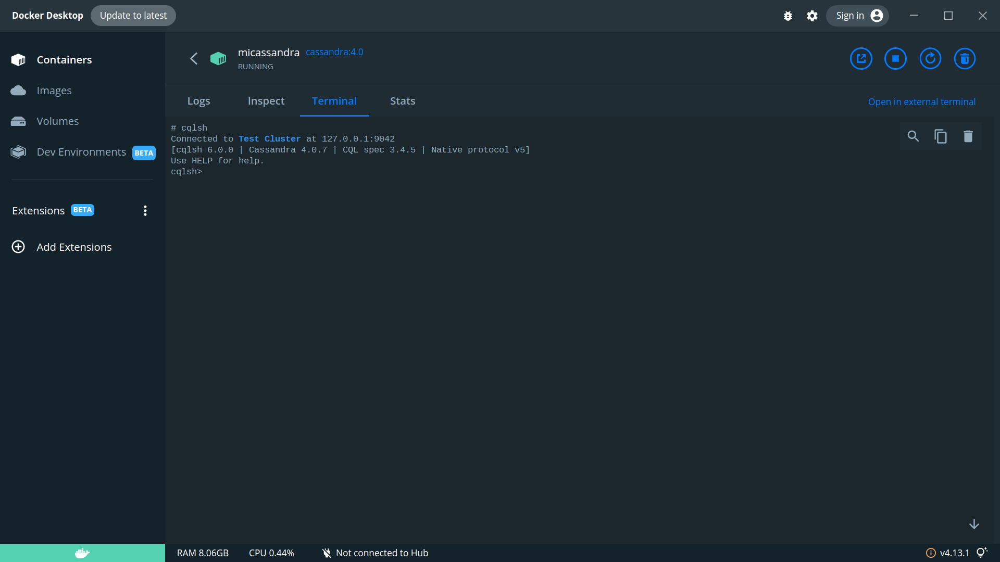

# Instrucciones Cassandra

## Instalación

1. Seguid las [instrucciones de instalación de Docker](../instrucciones_docker/instrucciones_docker.md)

2. Abrid una terminal: `cmd` en Windows

3. Cread un contenedor `micassandra` mediante el siguiente comando, que descarga la imagen adecuada:

   `docker run -p 9042:9042 --name micassandra -d cassandra:4.0`

## Conexión a Cassandra en modo interactivo: cqlsh

### Desde Docker Desktop

1. Acceded a la pestaña _Containers_
2. Comprobad que el contenedor `micassandra` aparece en la lista de contenedores, y que se encuentra en ejecución
3. Haced doble click en el elemento de la lista
4. En la ventana resultante, haced click en la pestaña terminal
5. Ejecutad el comando `cqlsh`, que os cambiará el prompt de la terminal a `cqlsh>`, permitiéndoos ejecutar comandos CQL sobre el contenedor



### Desde la terminal de vuestro sistema:

1. Abrir una shell de CQL en modo interactivo en el contenedor `micassandra`:

```
docker exec -it  micassandra cqlsh
```

2. El comando anterior debería cambiarnos el prompt de la terminal a `cqlsh>`, permitiéndonos ejecutar comandos CQL sobre el contenedor.

## Conexión a Cassandra desde Visual Studio Code

Visual Studio Code es un editor de texto multiplataforma que además permite instalar extensiones que pueden llegar a convertirlo en un entorno de desarrollo completo. Entre otros, estas extensiones proporcionan soporte para distintos lenguajes de programación, para gestionar control de versiones, ejecutar/depurar programas, etcétera.

Utilizar Visual Studio Code facilitará el guardado de las consultas que ejecutes, al parecerse más el modo de trabajo a SQL Server Management Studio, por ejemplo.

Seguid los siguientes pasos:

1. Instalad Visual Studio Code en tu equipo: https://code.visualstudio.com/Download

2. Instalad las siguientes extensiones:

   - [SQLTools](https://marketplace.visualstudio.com/items?itemName=mtxr.sqltools)  y [SQLTools Cassandra](https://marketplace.visualstudio.com/items?itemName=JordanHury.sqltools-cassandra): permiten conectarnos al nodo de Cassandra iniciado en el contenedor Docker
   - [CQL](https://marketplace.visualstudio.com/items?itemName=LawrenceGrant.cql): Proporciona coloreado de sintaxis, plantillas de escritura, etc.

Para instalar las extensiones, podéis buscarlas directamente en el buscador del editor:

   

   Si no os aparecen las extensiones, una segunda manera de instalarlas es mediante el comando proporcionado en los enlaces de las extensiones. Por ejemplo, para instalar SQL Tools, abrimos el menú rápido de Visual Studio Code (`Ctrl + P`) y escribimos `ext install mtxr.sqltools`

3. Configurad la conexión a Cassandra en el menú SQL Tools:

  

4. Ejecutando consultas: seleccionamos la consulta y hacemos click derecho -> ejecutar (o mediante el atajo de teclado doble [Control + E] + [Control + E], que se puede hacer simplemente manteniendo pulsado Control y pulsando dos veces a la E). Debe estar la conexión a Cassandra del punto anterior establecida:

   

## Pruebas

Os dejo aquí unos ejemplos de CQL para que probéis su ejecución. Ejecutadlos uno a uno, en la terminal o en VS Code (copiadlos a un fichero con extensión CQL):

```cql
-- creación de keyspace (equivalente a esquema en el modelo relacional)
create keyspace instalacion
with replication = {'class': 'SimpleStrategy', 'replication_factor' : 1};

-- al igual que en sql, se necesita "usar" el keyspace para trabajar contra él
use instalacion;

-- creación de una tabla
-- veremos por qué es buena idea definir esta primary key
create table perro (
     raza text,
     identificador text,
     nombre text,
     primary key (raza, identificador)
 );

-- inserciones
insert into perro (raza, identificador, nombre)
values ('border collie', '1', 'trufa');

insert into perro (raza, identificador, nombre)
values ('border collie', '2', 'alfa');

insert into perro (raza, identificador, nombre)
values ('ratonero', '3', 'lindi');


-- consultas (nota: algunas devolverán error, está previsto y marcado)

-- esta consulta funciona
select * from perro where raza = 'border collie';

-- OJO! esta consulta os mostrará un error
select * from perro where nombre = 'lindi';

-- Esta no. Veremos por qué en clase
select * from perro where nombre = 'lindi' allow filtering;

-- Esta también falla
select * from perro where identificador = '2';
```
