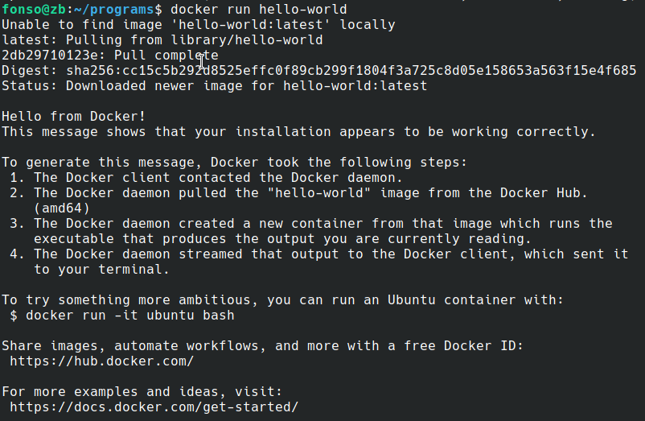
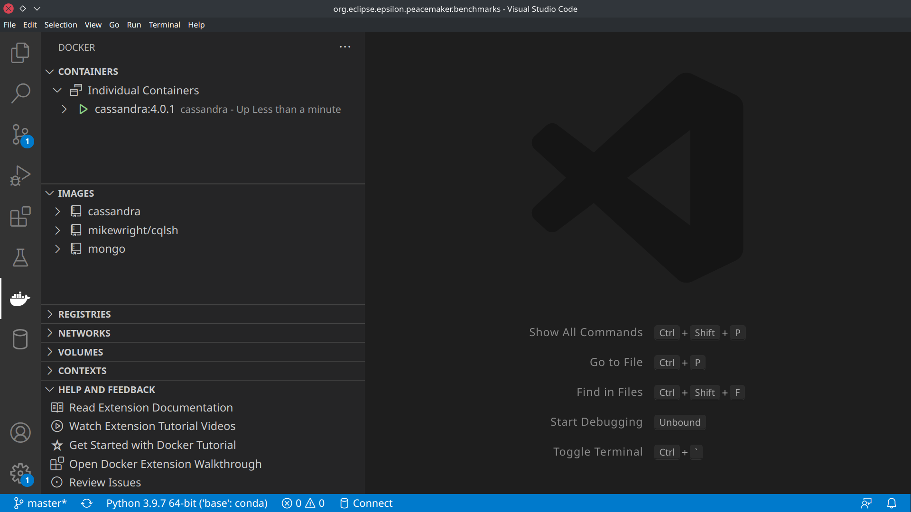

# Instrucciones Docker

## Instalación

1. Instalar el Docker Desktop adecuado para vuestro equipo: https://docs.docker.com/get-docker/
  - En el caso de Windows, debéis aceptar la instalación del *Windows Subsystem for Linux 2* (WSL 2) y el *Linux kernel update package*. Esto es necesario para el funcionamiento interno de Docker.
  - En el caso de que utilicéis Linux, seguid las instrucciones de este enlace para que no sea necesario utilizar `sudo` para ejecutar los comandos `docker` siguientes: https://www.configserverfirewall.com/ubuntu-linux/add-user-to-docker-group-ubuntu/
2. Para que el comando `docker` funcione en vuestra terminal, debéis tener la aplicación Docker Desktop ejecutándose.
3. Para comprobar que la instalación se ha realizado correctamente, podéis crear un contenedor de prueba con el siguiente comando: `docker run hello-world`

El resultado debería ser el siguiente:

## Uso de Docker Desktop

La aplicación Docker Desktop os proporciona, además del cliente de terminal para ejecutar los comandos anteriores, un [dashboard](https://docs.docker.com/desktop/dashboard/) donde podréis gestionar los contenedores activos. Siguiendo la instalación que encontráis en la parte de arriba, deberíais disponer de Docker Desktop en vuestro equipo.

- En Windows, es importante arrancar Docker Desktop con permisos de administrador
- Esta aplicación debe estar en ejecución para poder utilizar `docker`desde la terminal
- En _Images_, se muestra la lista de imágenes que habéis descargado. Estas imágenes se utilizan para crear contenedores en vuestra máquina (podéis pensad en ellas como un instalador de máquinas virtuales, que serían los contenedores)
- En _Containers_, se muestra la lista de contenedores que hayáis creado. Desde esta vista podeis arrancar y parar los contenedores, además de abrir terminales dentro de los contenedores que se encuentren arrancados, que en la mayoría de los casos utilizan Linux como sistema operativo.

## Comandos útiles de terminal

Desde la terminal de vuestro sistema, también podéis gestionar vuestros contenedores de Docker con los siguientes comandos:

- `docker stats`: Monitoriza el estado de los contenedores (útil también para recordar su nombre).
  - Utilizad `Ctrl+C`  para cerrarlo
- `docker start <nombre_contenedor>`: Arranca un contenedor que se encuentre parado
- `docker stop <nombre_contenedor>`: Para un contenedor
- `docker kill <nombre_contenedor>`: Fuerza la parada de un contenedor. Para cuando el contenedor no responde a una petición de `stop`

Existen muchos más comandos:

- Podéis obtener una lista utilizando `docker help`
- Podéis consultar la ayuda de un comando concreto mediante `docker help <nombre_comando>`
    - Ejemplo: `docker help start`

## Uso de Docker desde Visual Studio Code (opcional)

Visual Studio Code es un editor de texto multiplataforma que además permite instalar extensiones que pueden llegar a convertirlo en un entorno de desarrollo completo. Entre otros, estas extensiones proporcionan soporte para distintos lenguajes de programación, para gestionar control de versiones, ejecutar/depurar programas, etcétera.

1. Instalar Visual Studio Code en tu equipo: https://code.visualstudio.com/Download
2. Instalar la siguiente extensión: [Docker Extension for Visual Studio Code](https://code.visualstudio.com/docs/containers/overview)

Ahora podremos visualizar las imágenes descargadas e iniciar y parar contenedores desde Visual Studio Code (De nuevo, Docker Desktop tiene que estar arrancado). En principio, esta extensión no permite descargar imágenes o crear nuevos contenedores, tareas que realizaremos mediante comandos directamente en la terminal.

