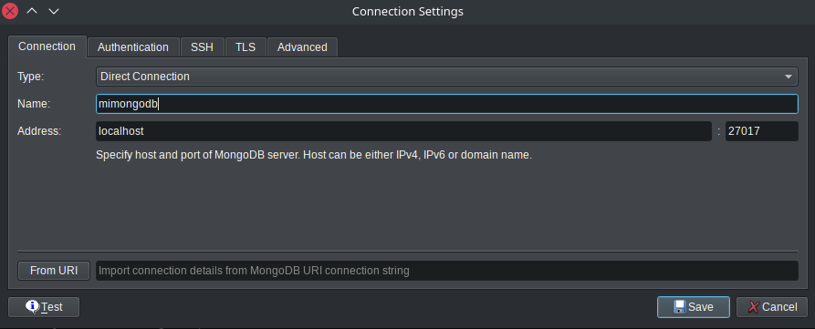
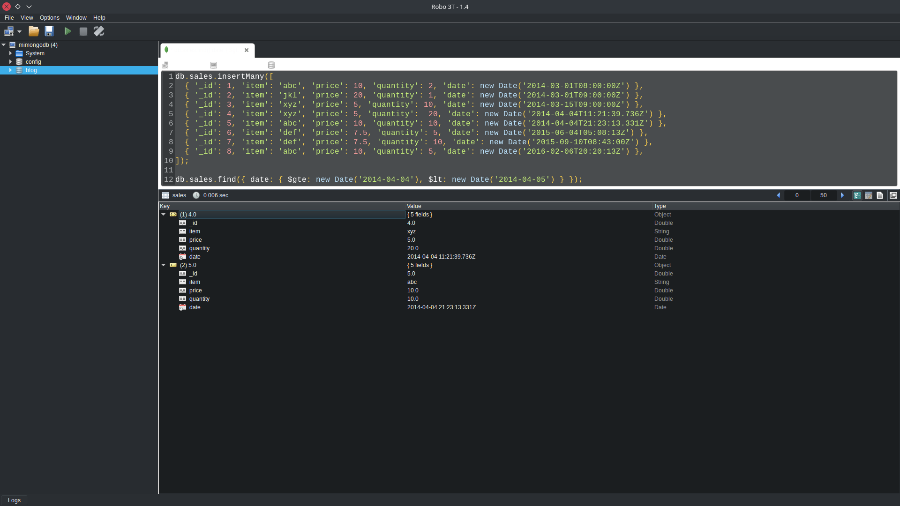
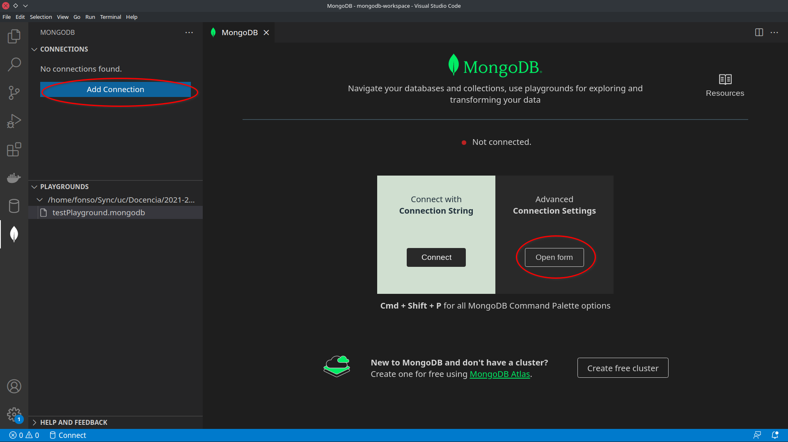
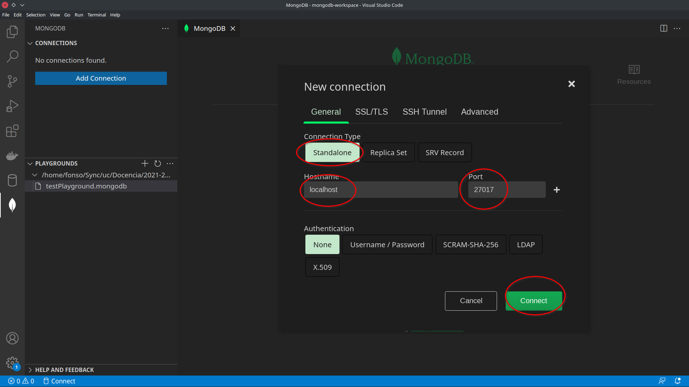
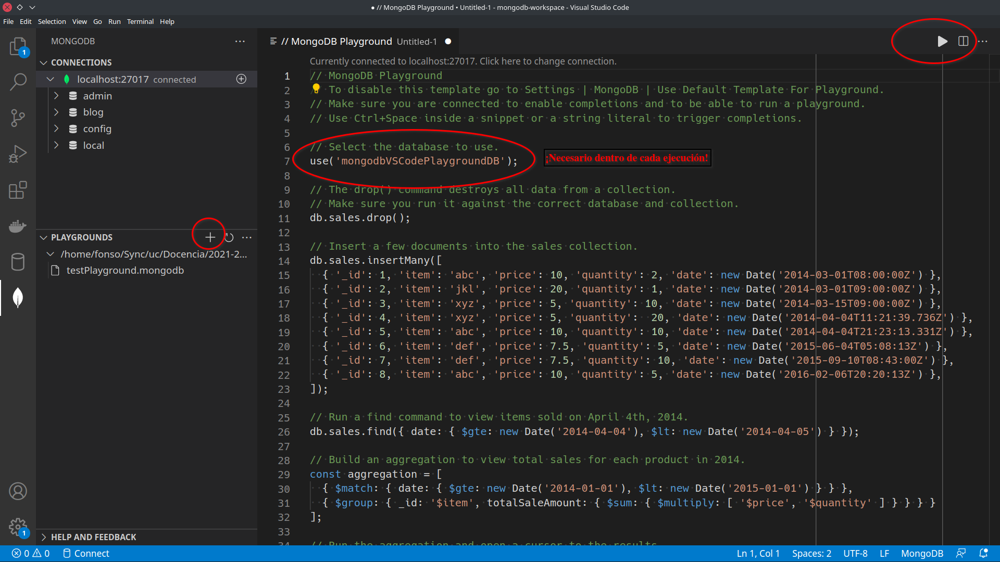

## Instalación de MongoDB vía Docker

1. Seguid las [instrucciones de instalación de Docker](../instrucciones_docker/instrucciones_docker.md)

2. Abrid una terminal: `cmd` en Windows

3. Cread un contenedor `mimongodb` mediante el siguiente comando, que automáticamente descarga la imagen adecuada:

   `docker run -p 27017:27017 --name mimongodb -d mongo:5.0`

## Conexión desde Studio 3T (opción recomendada)

Studio 3T es una aplicación gráfica multiplataforma que nos permite conectarnos a nuestro servidor MongoDB

1. [Descarga de Studio 3T](https://studio3t.com/download-studio3t-free):
    - Nos solicitan registrarnos con unos datos, cualquiera sirve.
    - Seleccionad la vista "shell" al abrir nuevas conexiones

2. Conexión a nuestro contenedor Docker:

   

3. Creación de base de datos (que contendrá nuestras colecciones de documentos)

   - Click derecho en la conexión -> Crear base de datos...

4. Apertura de una shell sobre la nueva base de datos:

   - Click derecho en la base de datos -> Abrir shell

5. Ejecución de consultas: con `F5` (permite ejecutar todo o ejecutar selección)

   

6. El contenido de nuestra shell puede ser guardado (y cargado posteriormente) a un fichero con extensión `.js`

## Conexión desde Visual Studio Code (Opcional)

Si bien se puede utilizar esta opción, la herramienta Robo 3T es más cómoda, principalmente porque la manera de ejecutar consultas en VSCode es más laboriosa. No es necesario instalar esta opción si se utiliza Robo3T.

- Cada vez que deseemos ejecutar una instrucción dentro de uno de los "playgrounds" (descritos debajo), debemos incluir también la instrucción `use('<nombre_bd>')`, ya que no se recuerda la base de datos utilizada en las ejecuciones previas (si no lo incluimos, utilizará `test` por defecto)
- Estos problemas no se dan en Robo3T, ya que las "shell" de ejecución se abren directamente contra una base de datos, que se crea desde la interfaz gráfica como se ha descrito arriba.

Visual Studio Code es un editor de texto multiplataforma que además permite instalar extensiones que pueden llegar a convertirlo en un entorno de desarrollo completo. Entre otros, estas extensiones proporcionan soporte para distintos lenguajes de programación, para gestionar control de versiones, ejecutar/depurar programas, etcétera.

1. Instalar Visual Studio Code en tu equípo: https://code.visualstudio.com/Download

2. Instalar la siguiente extensión: [MongoDB for Visual Studio Code](https://marketplace.visualstudio.com/items?itemName=mongodb.mongodb-vscode)

   - En sistemas Linux con un entorno distinto a Gnome (e.g. KDE), es necesario instalar el paquete `gnome-keyring` [para el almacenamiento de credenciales](https://github.com/microsoft/vscode-docker/issues/1515)
     - `sudo apt update`
     - `sudo apt install gnome-keyring`

3. Configuración de la conexión:

   

   

4. Uso de playgrounds: Aunque en principio parecen una buena opción, cada ejecución dentro de uno de estos playgrounds requiere incluir la instrucción `use('<nombre_bd>')`, para que dicha ejecución se realice en la base de datos adecuada. [Link explicativo](https://www.mongodb.com/community/forums/t/mongodb-for-vs-code-wont-change-db/9278/2)

   

## Probando la instalación

[Estas instrucciones](import_analytics_db.md) explican cómo descargar e importar una base de datos en tu nuevo contenedor de MongoDB.
