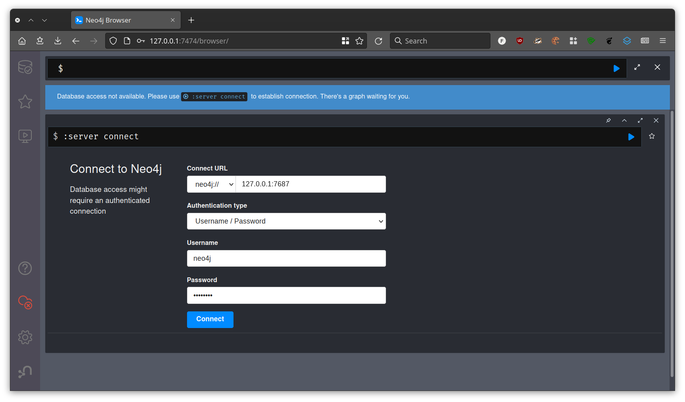
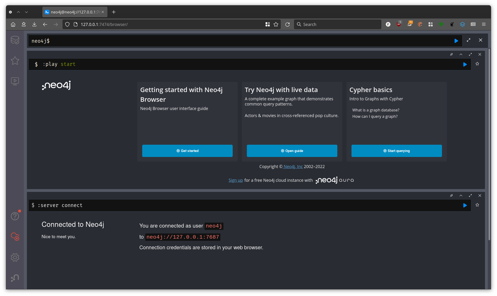

## Instalación de Neo4j vía Docker

1. Sigue las [instrucciones de instalación de Docker](../instrucciones_docker/instrucciones_docker.md)

2. Abre una terminal: `cmd` en Windows

3. Crea un contenedor `neo4j` mediante el siguiente comando:

   `docker run -d --name neo4j -p7474:7474 -p7687:7687 -e NEO4J_AUTH=neo4j/password neo4j:4.4.16`

Una vez creado se puede monitonizar, iniciar y parar (entre otras) con comandos `docker` o con la extensión de Visual Studio Code descrita en las instrucciones de Docker.

## Cliente Neo4j Browser

1. Accede a la siguiente dirección url en el navegador: http://127.0.0.1:7474/
2. Conéctate a la base de datos Neo4j utilizando el otro puerto abierto (7687) y el usuario y contraseña especificados en el comando de docker ("neo4j" y "password"):

3. Puedes familiarizarte con la interfaz web mediante la opción "Getting Started with Neo4j Browser":

4. También puede resultar de utilidad el [tour visual](https://neo4j.com/docs/browser-manual/current/visual-tour/) ofrecido por la documentación oficial.

5. Comprende cómo las consultas se ejecutan en celdas, que pueden ser re-ejecutadas y editadas posteriormente. Es importante coger la práctica de salvaguardar las consultas de interés en un fichero de texto externo una vez se hayan completado.

## Cypher Query Language para Visual Studio Code (opcional)

Si se desea obtener coloreado de sintaxis al abrir ficheros `.cypher` en Visual Studio Code, se puede utilizar [esta extensión](https://marketplace.visualstudio.com/items?itemName=jakeboone02.cypher-query-language). Puede resultar de utilidad a la hora de salvaguardar los comandos ejecutados en la interfaz web de Neo4j Browser.
